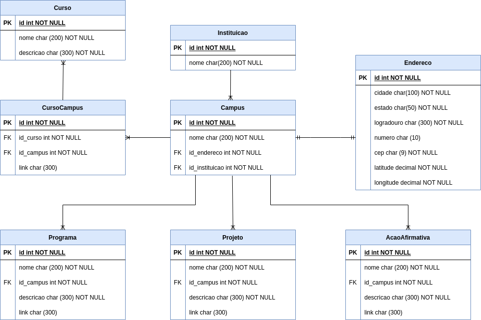

# Aquilombar

## Sobre
Este sistema web tem como intuito possibilitar o cadastro, edição e deleção das instituições e seus câmpus, assim como os projetos, programas e ações afirmativas de cada câmpus. Os dados cadastrados neste projeto serão consumidos por outro projeto que irá ser de acesso do público geral.

## Diagrama do Banco de Dados
Abaixo está o diagrama que representa as tabelas existentes no banco de dados do projeto, assim como suas relações entre si.

_Favor manter o diagrama mais atualizado o possível_